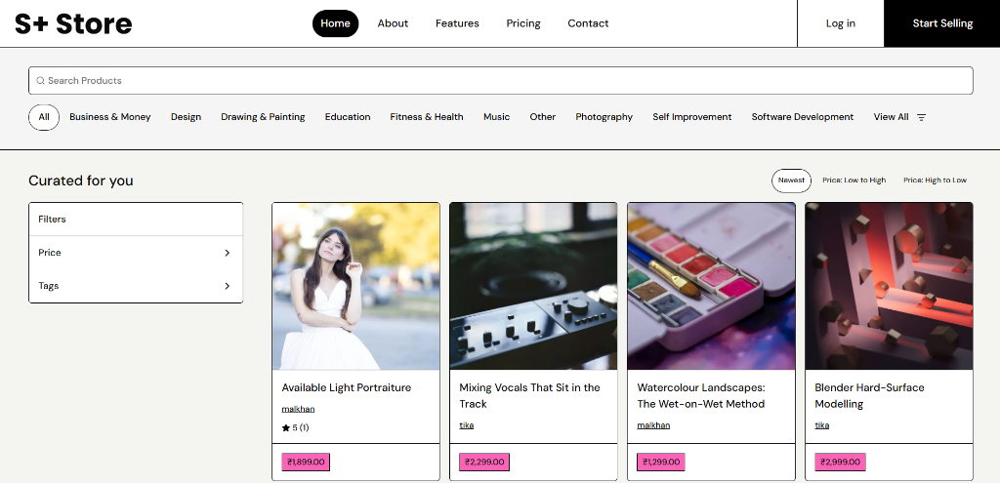
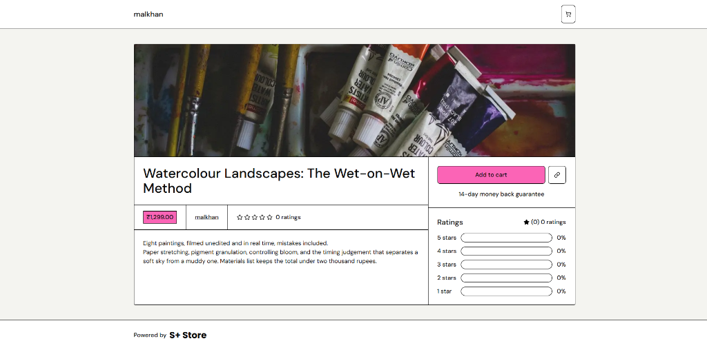
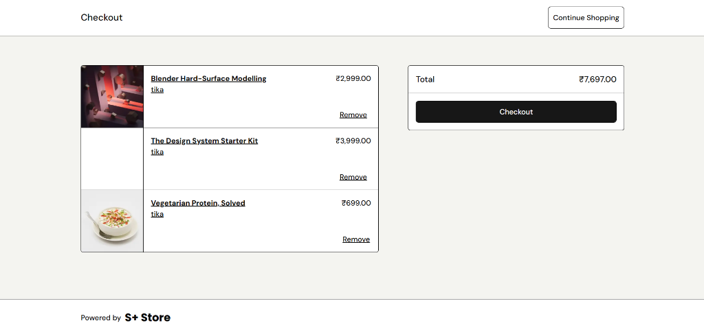
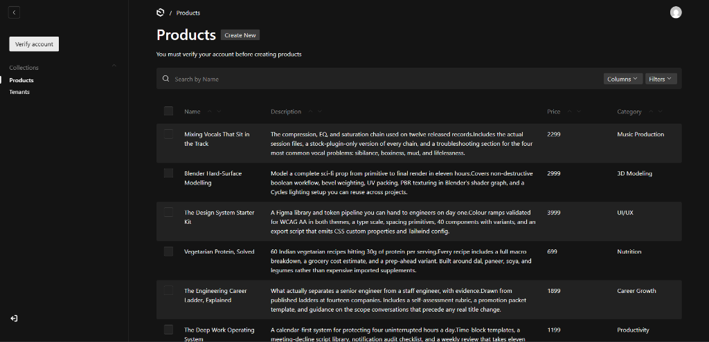
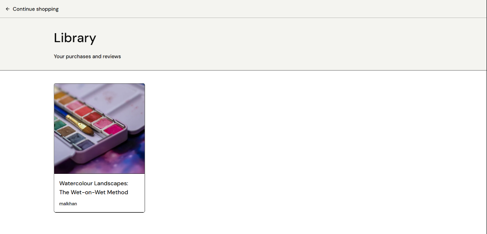
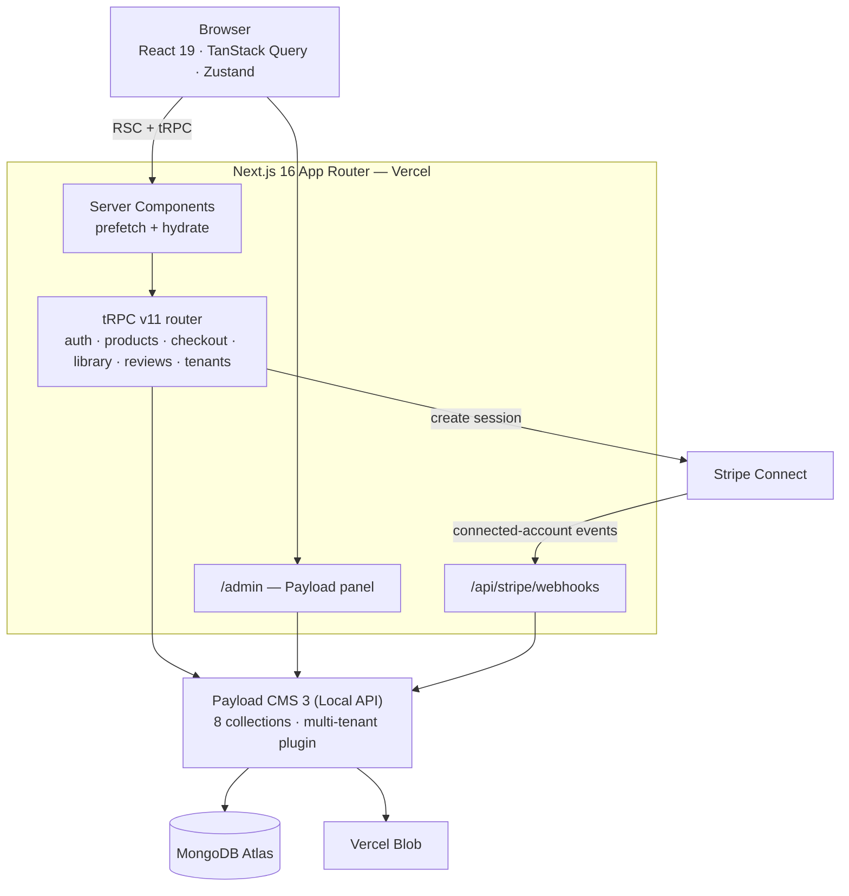
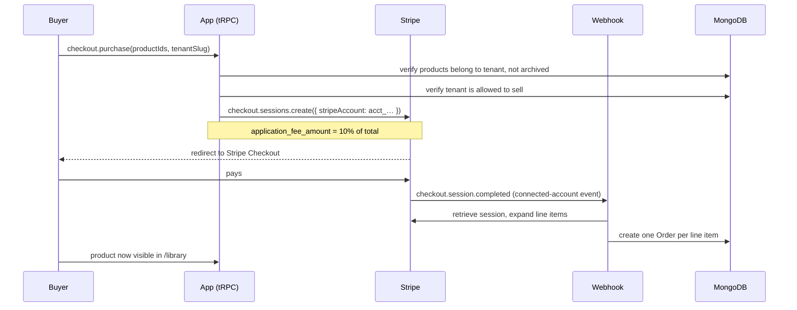

# S+ Store

A multi-tenant digital products marketplace. Sellers onboard through Stripe Connect, get their own storefront, and list digital products; buyers browse across all stores, pay through Stripe Checkout, and access what they bought in a personal library. The platform takes a configurable cut of every sale.

**[Live demo](https://s-plus-store.vercel.app)** · Built with Next.js 16, Payload CMS 3, tRPC, and Stripe Connect

> **Note** — this is a portfolio project running in Stripe **test mode**. Use card `4242 4242 4242 4242` with any future expiry and any CVC. No real money moves. Product listings are demo data.

---



<table>
  <tr>
    <td></td>
    <td></td>
  </tr>
  <tr>
    <td></td>
    <td></td>
  </tr>
</table>

---

## What it does

**For buyers** — browse products across every seller, filter by category, subcategory, tag and price range, search by name, and sort the results. Add items to a per-seller cart, check out through Stripe, and find purchases in a permanent library with access to gated content.

**For sellers** — register, complete Stripe Connect onboarding, and get a storefront at `/tenants/<slug>` (or `<slug>.yourdomain.com` with subdomain routing enabled). Manage products through the Payload admin panel, scoped so each seller only sees their own data.

**For the platform** — an application fee is taken from every transaction via Stripe Connect direct charges, a super-admin role can see across all tenants, and orders are created by webhook rather than by trusting the browser's redirect.

## Architecture



Requests never touch Payload's REST API from the app itself — every read and write goes through tRPC into Payload's **Local API**, which runs in-process and skips the HTTP hop entirely.

## Payment flow

The part worth reading. Charges are **direct charges on the connected account**, meaning the seller is the merchant of record and the platform collects an application fee on top.



Fulfilment is driven entirely by the webhook, never by the success redirect — a buyer closing the tab before the redirect still gets their purchase.

Because the events originate on connected accounts rather than the platform account, the webhook endpoint must be registered with **Events from → Connected accounts**. Registering it against the platform account is silent: payments succeed, no events arrive, no orders are ever created.

## Tech stack

| Layer | Choice | Why |
|---|---|---|
| Framework | Next.js 16 (App Router) | Server Components for data-heavy listing pages, route groups for layout isolation |
| CMS / ORM | Payload CMS 3 | Generates the admin panel, schema, and access control from one config; Local API avoids an HTTP hop |
| Database | MongoDB (Mongoose adapter) | Document model fits Payload's schema-driven collections |
| API | tRPC v11 | End-to-end type safety without codegen; Zod validation at the boundary |
| Server state | TanStack Query v5 | SSR prefetch → `HydrationBoundary` → client cache, no double-fetch on load |
| Client state | Zustand | Per-tenant cart persisted to `localStorage` |
| URL state | nuqs | Filters and sort live in the query string, so views are shareable |
| Payments | Stripe Connect | Direct charges, seller onboarding via Account Links, application fees |
| File storage | Vercel Blob | Product images and covers, served from a public store |
| Styling | Tailwind CSS 4 + shadcn/ui | — |

## Project structure

```
src/
├── app/
│   ├── (app)/
│   │   ├── (home)/           # storefront: /, /[category], /[category]/[subcategory]
│   │   ├── (library)/        # purchased products
│   │   └── (tenants)/        # per-seller storefronts + checkout
│   ├── (auth)/               # sign in / sign up
│   ├── (payload)/            # Payload admin panel
│   └── api/stripe/webhooks/  # Stripe Connect webhook receiver
├── collections/              # Users, Tenants, Products, Categories, Tags, Media, Orders, Reviews
├── modules/                  # feature modules
│   └── <feature>/
│       ├── server/procedure.ts   # tRPC procedures
│       ├── ui/views/             # page-level components
│       ├── ui/components/        # feature components
│       └── hooks/ · store/       # client state
├── trpc/                     # router composition, context, query client
├── lib/                      # stripe client, access helpers, utils
└── payload.config.ts
```

Each feature is self-contained: its procedures, views, components and state live together, so a change to checkout doesn't reach into products.

## Running locally

**Prerequisites** — [Bun](https://bun.sh), a MongoDB database (Atlas free tier is fine), and a Stripe account in test mode.

```bash
git clone https://github.com/arnav0406/s-plus-store.git
cd s-plus-store
bun install
cp .env.example .env      # then fill it in — see below
bun run db:seed           # categories, admin tenant, admin user
bun dev
```

Open <http://localhost:3000>. The admin panel is at `/admin`.

For webhooks in development, Stripe can't reach `localhost`, so tunnel them:

```bash
stripe listen --forward-to localhost:3000/api/stripe/webhooks
```

Copy the `whsec_…` it prints into `STRIPE_WEBHOOK_SECRET`. In production this value comes from the webhook endpoint you register in the Stripe dashboard instead — they are different secrets.

### Environment variables

| Variable | Purpose |
|---|---|
| `DATABASE_URI` | MongoDB connection string |
| `PAYLOAD_SECRET` | Signs Payload auth tokens |
| `STRIPE_SECRET_KEY` | Stripe API key (`sk_test_…`) |
| `STRIPE_WEBHOOK_SECRET` | Signing secret for the webhook endpoint |
| `BLOB_READ_WRITE_TOKEN` | Vercel Blob token — the store must be **public**; the Payload adapter does not support private stores |
| `NEXT_PUBLIC_APP_URL` | Base URL, **no trailing slash** |
| `NEXT_PUBLIC_ROOT_DOMAIN` | Root domain for subdomain routing and the auth cookie |
| `NEXT_PUBLIC_ENABLE_SUBDOMAIN_ROUTING` | `"true"` for `<slug>.domain.com`, otherwise `/tenants/<slug>` |

### Seeding demo data

```bash
bun run db:seed                       # categories, admin tenant, admin user
bun run db:seed:products -- --dry-run # preview the product plan, writes nothing
bun run db:seed:products              # 24 products across 2 tenants, images from Pexels
bun run db:seed:products -- --purge   # remove everything the product seeder created
```

The product seeder needs `PEXELS_API_KEY` (free, no card) and existing tenant slugs, passed as `TENANT_SLUGS=slug-a,slug-b`. It is idempotent — reruns skip products that already exist by name.

## Engineering notes

A few decisions worth calling out:

**Reviews are aggregated in one query, not N.** The listing endpoint originally ran a separate reviews query per product — nine round trips to render eight cards. It now fetches all reviews for the page in a single `find` with `product: { in: [...] }` at `depth: 0` and groups them in memory.

**Every route has a loading boundary.** All pages are `force-dynamic`, so without a `loading.tsx` the App Router keeps the previous page on screen until the server responds — which reads to a user as "the click did nothing". A `<Suspense>` inside the page doesn't cover this; it only applies once the response is already streaming.

**Images declare their layout size.** `next/image` with `fill` and no `sizes` defaults to `100vw`, so a 300px product card was downloading the 3840px variant.

## Known limitations

Being honest about what this isn't:

- **No test suite.** The next thing I'd add, starting with the webhook and checkout gating.
- **No CI/CD** beyond Vercel's build.
- **Sorting is by date and price only.** "Trending" would need order-velocity data the schema doesn't collect yet.
- **No rate limiting** on auth endpoints.
- **Connected accounts are created with `country: 'US'`** while pricing is in INR — fine in test mode, would need resolving before real transactions.
- **Fulfilment is not idempotent yet.** A Stripe webhook retry after a partial failure could duplicate order rows.

## Attribution

The foundation of this project came from following Code With Antonio's multi-vendor marketplace tutorial, which I used to learn Payload CMS, tRPC and Stripe Connect. What I did beyond that was deploy it and make it work in production along with the data seeding, query and navigation performance work, and the fixes listed above.

I'd rather say that plainly than have someone recognise the architecture and wonder what else I was vague about.
